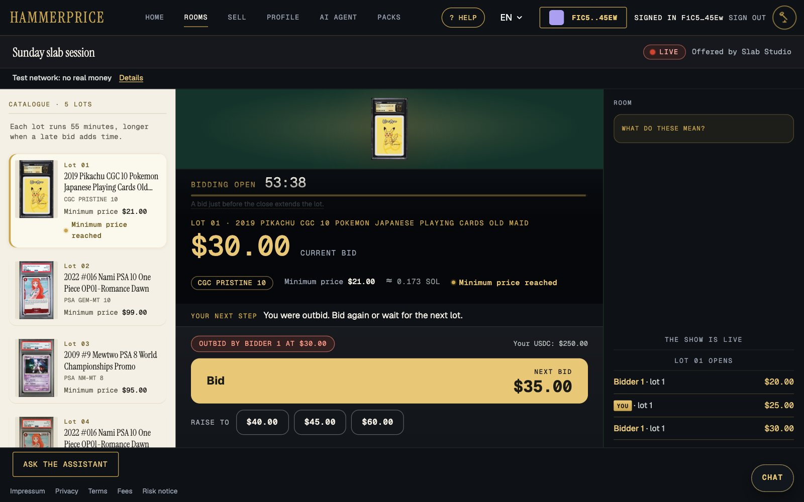
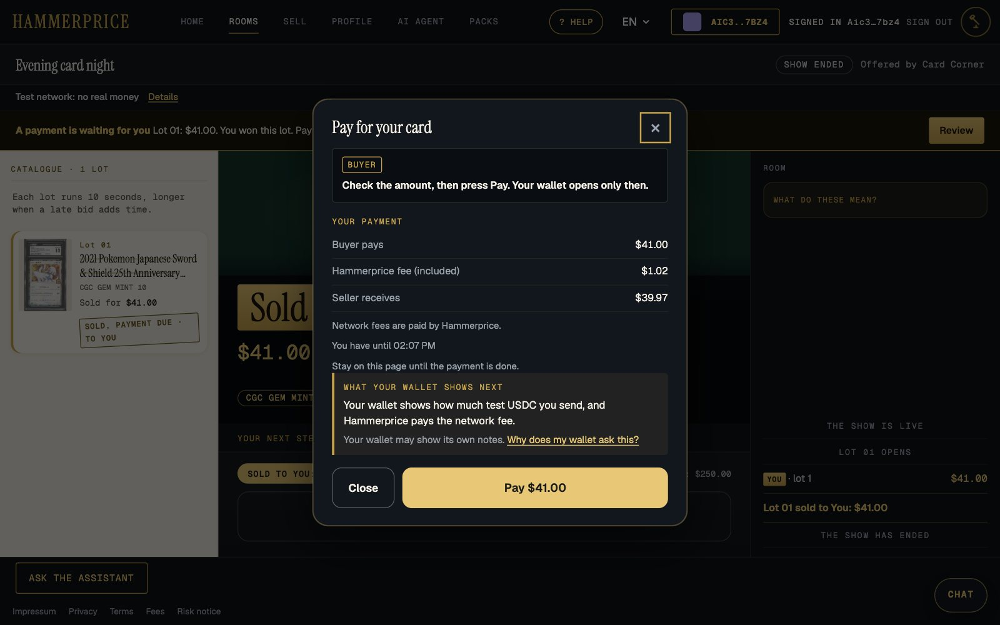
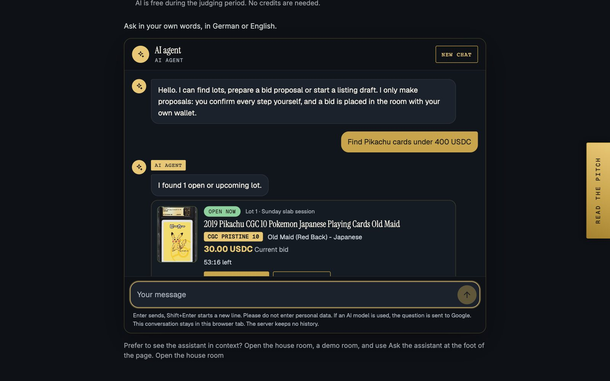
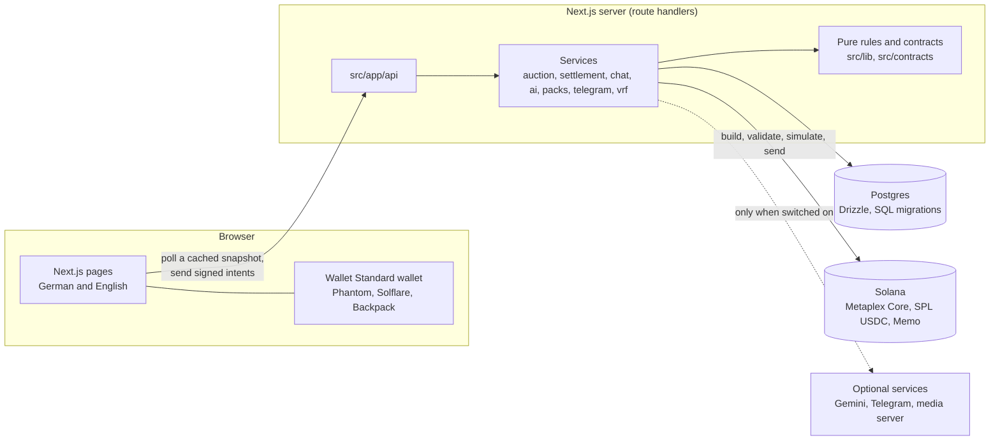

<p align="center">
  
</p>

# Hammerprice

**Live auctions for graded trading cards that already exist on Solana. The hammer is the payment.**

Bids are signed and funded, a server clock closes each lot, and at the close the buyer and the seller each sign one transaction that pays the
seller in USDC, pays the 2.5% seller fee and moves the card to the buyer, all or nothing. The platform holds neither the money nor the card and
has no key with authority over either. German and English throughout.

[](https://www.youtube.com/watch?v=dhHdjb10-hk)

<p align="center">
  
  
  
</p>

| | |
|---|---|
| Live site | https://hammerprice-earn.vercel.app ([English](https://hammerprice-earn.vercel.app/en), [Deutsch](https://hammerprice-earn.vercel.app/de)) |
| Demo video | https://www.youtube.com/watch?v=dhHdjb10-hk |
| Telegram bot | [`@hammerpricebot`](https://t.me/hammerpricebot) (connect it from your profile, "Connect Telegram") |
| Repository | https://github.com/FutureWebservice/hammerprice-colosseum |
| Network | Solana **devnet** (test USDC, replica cards) |
| Licence | [MIT](LICENSE) |

> **Status.** The live site is the hackathon beta and runs on **Solana devnet**. Mainnet is planned and has never been run; one setting moves
> the code there. There are no users, no volume and no revenue, and none is claimed. Built for the Colosseum hackathon. One of ten prize winners
> at Superteam Germany's Road to Colosseum Ideathon.

**Contents**

- **Product:** [Features](#features) · [How a sale works](#how-a-sale-works) · [Verified randomness](#verified-randomness)
- **Build:** [Architecture](#architecture) · [Tech stack](#tech-stack) · [Run it locally](#run-it-locally) · [Configuration](#configuration) · [Tests](#tests) · [Project structure](#project-structure)
- **Trust:** [Security and the non-custodial model](#security-and-the-non-custodial-model) · [Licence](#licence)

## Features

### Auctions

| | |
|---|---|
| **Live rooms and bidding** | Lots run one after another on a server clock. A bid is a wallet-signed message, funded by the bidder's USDC balance (nothing is locked), with anti-sniping (a late bid extends the lot), a live feed and outbid notices. Watching needs no wallet. |
| **Timed auctions** | One card open for 1 hour to 7 days with a soft close; the winner gets a longer window to pay. Listing is limited to the house and operator-allowed wallets. |
| **Demo rooms and real rooms** | The house runs a live demo room around the clock and timed demo lots with replica cards, all labelled DEMO. Labelled house bots keep a lot live but never outbid a person. Every other room is created by a seller and has no bots. |
| **Sell wizard** | Pick a Metaplex Core card from your wallet, set an optional minimum price and the lot length (45 s, 90 s, 3 min or 5 min), up to 30 lots per room. Pause and resume your room. On devnet you can mint a test card. |
| **Vault catalogue** | The landing page reads the Collector Crypt vault live (more than 150,000 graded cards). These cards cannot be bid on. |

### Payment and proof

| | |
|---|---|
| **One-transaction settlement** | USDC to the seller, the 2.5% fee, the Metaplex Core card to the buyer and a memo with the SHA-256 of the signed bid log, all or nothing. No buyer's premium; the buyer needs USDC and no SOL. Both sides sign inside the payment window (15 minutes for live lots), otherwise the lot shows as not completed and nothing moves. |
| **Non-custodial** | No custom on-chain program and no key with authority over funds or cards. The settlement key only pays network fees. |
| **Public audit page per sale** | `/en/verify/<lot id>` re-verifies every bid signature in the browser, hashes the log and compares it with the memo on Solana. |
| **Verified randomness** | The lot order of the house room and pack draws use ECVRF (RFC 9381), committed on chain, with a public proof page anyone can recompute. Never used for bids. |
| **Packs with published odds** | A draw from a public pool; odds, pool and a commitment hash are public before the first sale. Equal-value packs settle atomically. In a chance pack you pay the operator first, the ECVRF draw follows, and the operator delivers within a deadline or gets a strike. 18+, daily limit per wallet, a devnet demo pack to try it (a replica of the card you draw is minted into your wallet). |

### Chat and AI

| | |
|---|---|
| **Pre-moderated chat** | A message waits for approval: the room owner gets a popup with a preview and approves, rejects, mutes or blocks. Links and contact data are refused, visitors can report a message, and the public list shows a bidder number, never a wallet. |
| **AI agent** | The page `/en/ai` searches open lots in your own words (German or English) and prepares a bid proposal or a listing draft. It only proposes: you confirm and sign, and it never bids or pays. |
| **AI assistant in the room** | The same agent in a drawer next to the Chat button. It knows the lot on the block, answers from the room data and the FAQ, and prepares bid proposals. |
| **AI listing draft** | In the sell wizard the AI drafts a title and German and English text that the seller reviews before it is used. 1 USDC buys 10 drafts, or free with `AI_FREE=true`. |
| **AI guard rails** | Every AI function needs a signed-in wallet. Limits per wallet (6 messages a minute) and per address (100 a day), a daily and a monthly spend cap enforced in the database, and a kill switch. Everything is labelled AI. Model: Google Gemini. |

### Telegram

| | |
|---|---|
| **Telegram bot** | [`@hammerpricebot`](https://t.me/hammerpricebot) sends opt-in alerts when you are outbid, when you win and when a payment is due. `/watch 3`, `/watch 5`, `/watch 10` or `/watch all` announces the next lots of a live room, and each alert has a Bid button that opens the room with the amount filled in. The bot never bids and holds no key: you confirm in your wallet. |

### Account, access and operation

| | |
|---|---|
| **Sign in with Solana** | Phantom, Solflare and Backpack (Wallet Standard). Signing in is a free signature, not a transaction. On a phone, open the site in your wallet app's browser. |
| **Profile and wallet** | Username and avatar, USDC and SOL balances, your cards, bids, wins and payments, sales and Telegram settings. On devnet a faucet hands out test USDC. |
| **Waiting list** | For the mainnet launch, on the landing page. |
| **German and English** | Every page, the Telegram bot and the assistant's answers, one switch in the header. Responsive down to phone width. |
| **About page** | `/en/about`: how it works, all functions, a live randomness proof, pitch, FAQ with wallet help, glossary and team. Legal pages in both languages; no tracking or analytics, the only cookie is the session cookie. |
| **Admin panel** | `/admin`, only for `ADMIN_WALLETS` (everyone else gets a 404): overview, rooms, lots, history, users, cards, chats and the waiting list with CSV export. |
| **Feature switches** | Each optional feature has a `FEATURE_<NAME>` switch and a database kill switch that takes effect within about 5 seconds, without a deploy. A feature that is off shows "Switched off on this site". |

## How a sale works

1. **Bid.** A bid is a message the bidder's wallet key signs: show, lot, amount, network, nonce, time. The server checks the bidder's USDC
   balance minus their other leading bids. Nothing is locked.
2. **Close.** Every lot has a server-set closing time; a bid in the last seconds moves it later, up to a cap. The highest valid bid at or above
   the minimum price wins. No person presses a hammer.
3. **Sign.** The server builds the one legal settlement message and the browser rebuilds it from the same trusted inputs. Buyer and seller each
   sign (in the demo room the house key signs the seller's leg, so the winner signs once).
4. **Settle.** One transaction: USDC to the seller (price minus fee), USDC to the fee wallet (2.5%), the Metaplex Core card to the buyer, and a
   memo with the SHA-256 of the signed bid log. The platform key only pays the network fee.
5. **Check.** The audit page of the lot re-verifies every bid signature in the browser and compares the log hash with the memo on chain.

Two real settlements on devnet, bought with a real Phantom wallet:
[78 USDC](https://explorer.solana.com/tx/jNzE8GsVPwVKhyTXmEyqymPFmzj4oR72r2P3CoAWP2WTKJo4Axq9Y9hECQjCePHZRddSSs8Bphfehn5e89j4eGL?cluster=devnet) and
[22 USDC](https://explorer.solana.com/tx/3iaZ2AXJDHjEu8Ath9AGnkNdGDPSWRYtXQXhD2RYc22pNa6Yb8npxsCMxmKpjyosJVXGsb5SnQF7WvGE534vtptr?cluster=devnet).
The builder is [`src/lib/chain/settlement-tx.ts`](src/lib/chain/settlement-tx.ts); the validator that refuses every other message sits next to it.

## Verified randomness

The platform does not choose the lot order of the house room, and it can show that.

1. **Commit.** A memo transaction signed by the VRF key fixes the lot list before anything is drawn.
2. **Seed.** Once the commit is final and 32 slots have passed, the first confirmed block after that supplies the beacon. Its block hash did not
   exist at commit time.
3. **Prove.** The VRF key proves a fixed input (cluster, draw, committed lots, beacon) with ECVRF ([RFC 9381](https://www.rfc-editor.org/rfc/rfc9381),
   `@blueshift-gg/solana-ecvrf`) and writes the proof in a second memo. The order follows from the proof by a public rule.

Every draw has a public page, `/en/verify/random/<id>`, that recomputes each step in the browser. It cannot show that a result was never held
back: an unrevealed draw stays visible as "not completed" and the catalogue order applies.

## Architecture

Next.js 15 (App Router), Drizzle over Postgres, zod contracts. On Solana only Metaplex Core, SPL Token and Memo: **no custom on-chain program.**



- **A lazy server clock.** Every read and write calls an idempotent `advanceShow()` that closes what is due, opens the next lot and ends the show,
  so no lot waits for a worker. A housekeeping pass (expired settlements, chat retention, old demo rooms, VRF and pack sweeps, Telegram
  reminders) runs from a daily Vercel Cron (`/api/cron/sweep`, see [`vercel.json`](vercel.json)) and also whenever the rooms schedule is read, so
  a local run without a scheduler gets it too.
- **Contracts first.** [`src/contracts/`](src/contracts/) holds the zod schemas and types for every API route, event and chain structure.
- **Polling, not streaming.** The room polls a small public snapshot that a CDN can cache for one second.
- **Optional features are separate packages** (`src/server/{chat,ai,packs,telegram,vrf,streams}/`). The Telegram package never imports the auction
  service, and the AI agent can only propose.

## Tech stack

| Layer | What |
|---|---|
| App | Next.js 15, React 19, TypeScript, Tailwind CSS, next-intl |
| Data | Postgres (Neon or any), Drizzle ORM, SQL migrations, zod |
| Solana | `@solana/web3.js` 1.99, Metaplex Core (`mpl-core`, umi), SPL Token, Memo, Wallet Standard wallets |
| Randomness | ECVRF per RFC 9381 (`@blueshift-gg/solana-ecvrf`) |
| Optional services | Google Gemini, MediaMTX (WHIP and HLS), Telegram Bot API |
| Hosting | Vercel (Next.js) and Neon (Postgres) |
| Tests | Vitest, embedded Postgres 18, LiteSVM with the real Core program, fast-check |

## Run it locally

Needs Node 22, npm, `openssl` and a Postgres database (the Docker line below, or any recent Postgres; the tests use 18).

```bash
git clone https://github.com/FutureWebservice/hammerprice-colosseum.git && cd hammerprice-colosseum
docker run -d --name hammerprice-pg -p 5432:5432 -e POSTGRES_PASSWORD=postgres -e POSTGRES_DB=hammerprice postgres:18
cp .env.example .env.local
echo "VRF_SECRET_KEY=$(openssl rand -hex 32)" >> .env.local
npm ci && npm run db:migrate && npm run dev        # http://localhost:3000/en
```

`.env.example` already points `DATABASE_URL` at that Postgres and switches on every optional feature that needs no outside account:
`FEATURE_VRF`, `FEATURE_TIMED`, `FEATURE_CHAT`, `FEATURE_PACKS`, `FEATURE_AI` and `AI_FREE=true` (no AI credits needed). `FEATURE_VIDEO` and
`FEATURE_TELEGRAM` stay `false` because they need a media server and a bot token. `SESSION_SECRET` can stay empty for `npm run dev`.

That runs the site: landing page, About page, legal pages, German and English, and wallet sign-in. Rooms with lots, the room chat and the room
assistant appear once the house cards exist (the bootstrap below); until then the room page shows an empty state. What more needs:

| You want | You need |
|---|---|
| Rooms with lots to bid on, packs | Devnet cards and role keys: the bootstrap below (about 1 devnet SOL once) |
| Verified randomness on chain | `VRF_SECRET_KEY` (the `echo` line above) and a funded settlement authority |
| The AI agent page | `GEMINI_API_KEY` (a Google AI Studio key) in `.env.local`; without it the room assistant answers from the FAQ and the listing draft is a template |
| Live video, Telegram | A MediaMTX server, or a bot token and a public webhook URL (variables in `.env.example`) |

**A full sale on devnet locally.** The bootstrap creates four throwaway devnet keys, the test USDC mint, a Core collection and 8 house cards, and
prints the environment lines. It is safe to run again.

```bash
npm run devnet:bootstrap -- --env      # first run: creates the keys, stops and names the key to fund with devnet SOL (faucet.solana.com, choose devnet)
npm run devnet:bootstrap -- --env | grep -E '^[A-Z_]+=' >> .env.local     # after funding: mints, then appends the lines to .env.local
npm run dev                            # restart; the house room and its cards now appear
```

The keys live in a keys file in your home directory (override its path with `HP_KEYS_FILE`) and work on devnet only. The minted cards point their metadata at
`HP_PUBLIC_URL` (default: the live site). The public devnet RPC rate-limits (HTTP 429): the app then pauses that endpoint for 30 to 60 seconds and
tries `SOLANA_RPC_FALLBACK_URLS`; for steady use put your own devnet RPC URL into `SOLANA_RPC_URL` (the app) and `DEVNET_RPC_URL` (the bootstrap).

**Production build:** `npm run build && npm start` counts as a deployment. Sign-in then needs `SESSION_SECRET` (32+ random characters) and
`NEXT_PUBLIC_SITE_URL=http://localhost:3000`, otherwise it answers 503.

## Configuration

[`.env.example`](.env.example) lists every variable the app reads, names only, no secrets.

- **One network switch.** `SOLANA_CLUSTER` is `devnet` (default) or `mainnet-beta`; the USDC mint, explorer links, keys and every optional feature
  follow it. On `mainnet-beta` with an incomplete configuration, `/api/health` and every money route answer 503 `mainnet_config_incomplete`.
- **Feature switches** are exactly `true` or off. `FEATURE_VRF` and `FEATURE_PACKS` need `VRF_SECRET_KEY`; `FEATURE_PACKS` also needs the role keys
  and `PLATFORM_WALLET_ADDRESS` from the bootstrap; `FEATURE_AI` needs `GEMINI_API_KEY` (or `GCP_SERVICE_ACCOUNT_JSON` with `AI_PROVIDER=vertex`)
  for the agent; `FEATURE_VIDEO` needs `MEDIA_SERVER_URL`, `MEDIAMTX_PUBLISH_USER`, `MEDIAMTX_PUBLISH_PASS`; `FEATURE_TELEGRAM` needs
  `TELEGRAM_BOT_TOKEN`, `TELEGRAM_BOT_USERNAME`, `TELEGRAM_WEBHOOK_SECRET`. A row in the `app_flags` table with the lower-case name and the value
  `false` switches a feature off again.
- **AI spend.** `AI_DAILY_BUDGET_USD` and `AI_MONTHLY_BUDGET_USD` cap the cost (`.env.example` sets 0.5 and 5; the code defaults are 1 and 10).
- **Operators.** `ADMIN_WALLETS` opens `/admin`; `OPERATOR_WALLETS` run the house room; `SELLER_ALLOWLIST` says who may sell on mainnet;
  `HOUSE_BOTS_ENABLED` turns the labelled house bidders on.
- **Health.** `GET /api/health` reports database and RPC latency, the cluster and the feature switches.
- **Deployment.** The live site is Vercel plus a Neon database. Set the variables in the host's settings (`.env.example` is never read there), `CRON_SECRET` included: Vercel Cron sends it as a bearer token and the route refuses everything else. Migrations
  use the direct Neon URL (`DATABASE_URL_UNPOOLED`); the app uses the pooled one.

## Tests

`npm test` runs about 4,000 tests in 251 files: the auction engine under concurrency on real Postgres 18, the settlement validator against tampered
transactions, the real Metaplex Core program inside LiteSVM (the settlement transaction runs offline, byte for byte, with the devnet and the
mainnet USDC mint), the ECVRF library against the RFC 9381 vectors, property tests, German/English key parity and the legal pages. Database tests
start an embedded Postgres 18 and need a normal user, not root. Also: `npm run type-check` and `npm run lint`.

## Project structure

| Path | What |
|---|---|
| `src/app/[locale]/` | pages: landing, rooms, room, sell, account, verify, packs, AI, About, legal, admin |
| `src/app/api/` | route handlers: auth, shows, lots, bids, settlements, sell, packs, vrf, ai, telegram, streams, devnet helpers, admin, health |
| `src/contracts/` | schemas, types and fixtures shared by every module |
| `src/lib/auction/`, `src/server/auction/` | pure auction rules and the service that applies them |
| `src/lib/chain/`, `src/server/settlement/` | transaction builder and validator, settlement service |
| `src/lib/vrf/`, `src/server/vrf/` | ECVRF library and the verifiable draws |
| `src/server/{chat,ai,packs,telegram,streams}/` | the optional features |
| `src/locales/{en,de}/` | every message, same keys in both languages (a test compares them) |
| `src/db/`, `drizzle/` | schema and SQL migrations |
| `scripts/chain/` | devnet bootstrap and the house card minter |

## Security and the non-custodial model

In Germany, holding client funds is a payment service that needs a licence (section 10 ZAG), and USDC is e-money. So the platform never holds
money or a card: bids are signed messages, not balances, and settlement is a transaction the two parties sign. That is the operator's reading,
not a lawyer's review, and it describes auctions and equal-value packs; in a chance pack you pay the operator directly.

- **Validator.** The server rebuilds the only legal message from trusted database values and the browser rebuilds it from the same inputs. A
  changed amount, a redirected card, an extra transfer, a missing fee leg or an extra signer is rejected (tested against many tampered variants).
- **Signed intents, replay protection.** A bid is bound to show, lot, amount, network and nonce; the sign-in nonce is single use.
- **Strikes.** Twenty lapsed settlements or missed pack deliveries block a wallet. A lapsed settlement costs nobody money.
- **Keys.** The settlement authority only pays fees and rent and holds no authority over user assets. Keys live in the environment, never in the
  repository. The AI and Telegram packages hold no signing key.
- **The AI agent cannot act, and Telegram cannot bid.** A bid or a draft happens only when the person presses a button and signs with their own
  wallet.
- The legal texts in `src/legal/content/` are a good-faith draft; **no lawyer has reviewed them.**

## Licence

[MIT](LICENSE). Third-party code is used under its own licences; the two
brand fonts are under the SIL Open Font License (`assets/fonts/`). `src/lib/chain/__tests__/fixtures/mpl_core.so` is the Metaplex Core
program (Apache-2.0), used by the LiteSVM tests. Independent project, not affiliated with Collector Crypt, card publishers or grading
companies; card names and images belong to their owners, and the demo cards are devnet replicas.

Built by Farshad Shadjari, Future Webservice, Germany.
